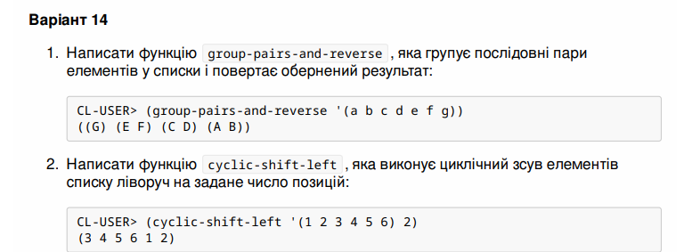

## МОНУ НТУУ КПІ ім. Ігоря Сікорського ФПМ СПіСКС

### Звіт з лабораторної роботи 2
 "Рекурсія"
 дисципліни "Вступ до функціонального програмування"

**Студент**: *Петраш Павло Степанович КВ-13*


**Рік**: *2025*

## Завдання за варіантом №13:
Реалізуйте дві рекурсивні функції, що виконують деякі дії з вхідним(и) списком(-ами), за
можливості/необхідності використовуючи різні види рекурсії. Функції, які необхідно
реалізувати, задаються варіантом (п. 2.1.1). Вимоги до функцій:
1. Зміна списку згідно із завданням має відбуватись за рахунок конструювання нового
списку, а не зміни наявного (вхідного).
2. Не допускається використання функцій вищого порядку чи стандартних функцій
для роботи зі списками, що не наведені в четвертому розділі навчального
посібника.
3. Реалізована функція не має бути функцією вищого порядку, тобто приймати функції
в якості аргументів.
4. Не допускається використання псевдофункцій (деструктивного підходу).
5. Не допускається використання циклів.
Кожна реалізована функція має бути протестована для різних тестових наборів. Тести
мають бути оформленні у вигляді модульних тестів (див. п. 2.3).



**Код для першої частини:**
```
(defun cyclic-shift-left (lst)
  (let ((result nil))
    (loop for (a b . rest) on lst by #'cddr
          do (setf result (cons (if b (list a b) (list a)) result)))
    result))


(format t "test 1: '(a b c d e f) -> '((E F) (C D) (A B)) ")
(print (cyclic-shift-left '(a b c d e f)))

(format t "test 2: '(a b c) -> '((C) (A B)) ")
(print (cyclic-shift-left '(a b c)))

(format t "test 3: nil -> nil ")
(print (cyclic-shift-left nil))
```
**Результат:**
```
Output:

test 1: '(a b c d e f) -> '((E F) (C D) (A B)) 
((E F) (C D) (A B))
test 2: '(a b c) -> '((C) (A B)) 
((C) (A B))
test 3: nil -> nil 
NIL 
```

**Код для другої частини:**
```
(defun cyclic-shift-left (lst n)
  (let* ((len (length lst))
         (shift (mod n len))
         (first-part (subseq lst shift))
         (second-part (subseq lst 0 shift))) 
    (append first-part second-part)))


          
(format t "test 4: '(1 2 3 4 5 6) 2) -> (3 4 5 6 1 2) ")
(print (cyclic-shift-left '(1 2 3 4 5 6) 2))

(format t "test 5: '(1 2 3 4 5 6) 0) -> (1 2 3 4 5 6) ")
(print (cyclic-shift-left '(1 2 3 4 5 6) 0))


```
**Результат:**
```
Output:

test 4: '(1 2 3 4 5 6) 2) -> (3 4 5 6 1 2) 
(3 4 5 6 1 2)
test 5: '(1 2 3 4 5 6) 0) -> (1 2 3 4 5 6) 
(1 2 3 4 5 6) 
```
